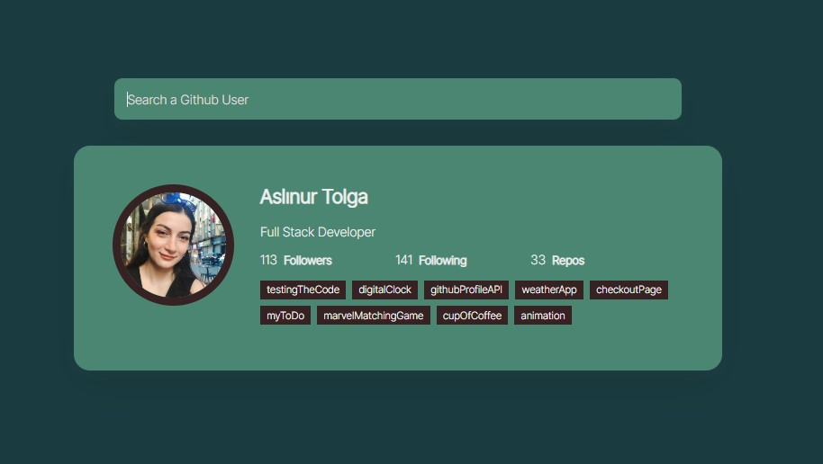

# Project : Github Profile API

## Check The Live Website :arrow_right: [Live Website](https://aslinurtolga.github.io/githubProfileAPI/)

## Animation of the Website

## Visulation of the Website

## Description

Project aims get information about github users via a GITHUB API

## Learning Outcomes

At the end of the this project, you will be able to;

- analyze a problem,

- demonstrate your knowledge of algorithmic design principles,

- get information about github users via a API.

## Project Skeleton 

|----githubProfileAPI

        |----index.html  
        |----script.js
        |----style.css
        |----images
                |----github1.jpg
                |----githubAPI.jpg
                |----github2.gif
        |----readme.md 

### Overview
I mastered HTML, CSS and Javascript fetch API features in this project. You can see the visual representation of the website above.

:fire: You can use [GITHUB API](https://api.github.com/users/) for your app. 
